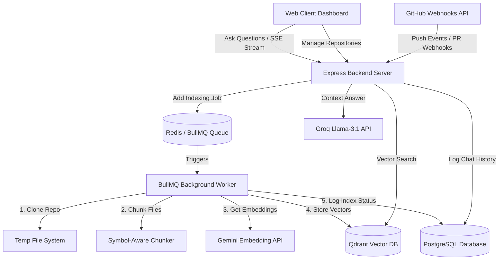
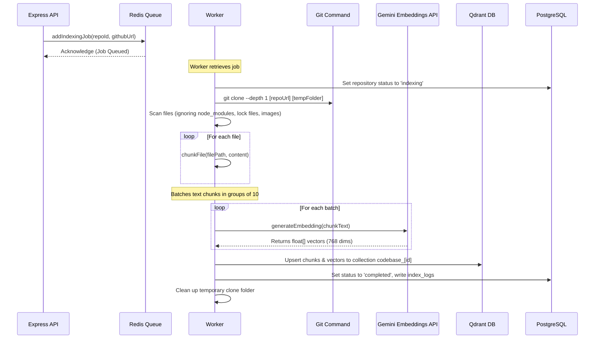

# Walkthrough - RAG Git Bot

# Walkthrough & System Architecture - RAG Git Bot

This document provides a comprehensive deep dive into the architecture, design patterns, database schemas, and implementation details of the **RAG Git Bot** codebase assistant and auto-reviewer.

---

## 🏗️ 1. Architecture Overview

The system is built as a split client-server architecture with an asynchronous, queue-driven background processing engine. It integrates a relational database (PostgreSQL), a queue system (Redis + BullMQ), and a vector database (Qdrant) to support both real-time queries and event-driven GitHub webhook processing.



---

## 💾 2. Relational & Vector Data Models

### A. PostgreSQL Schema
Initialized in [db.ts](file:///c:/Users/Dell/Downloads/koding%20repos/rag-git-bot/backend/src/config/db.ts), the relational layer tracks workspace state, ingestion runs, and historical threads:

*   **`repositories`**: Stores git repository reference urls, status (`pending`, `indexing`, `completed`, `failed`), and index timestamps.
*   **`index_logs`**: Tracks discrete indexing events, logging files updated, runtime duration in milliseconds, and detailed error messages upon failure.
*   **`chat_history`**: Holds conversational memory logs (`user` vs `bot` messages) mapped to specific repository scopes to power historical sessions.

### B. Vector Schema (Qdrant)
Each repository gets a dedicated collection named `codebase_${repoId}` inside Qdrant. The vector payload contains structural code segment metadata:
```json
{
  "id": "uuid-v4",
  "vector": [0.015, -0.082, ..., 0.043], // 768-dimension vector
  "payload": {
    "file_path": "src/services/queue.ts",
    "start_line": 21,
    "end_line": 55,
    "symbol_name": "indexingWorker",
    "symbol_type": "function",
    "language": "typescript",
    "content": "export const indexingWorker = new Worker(..."
  }
}
```

---

## ✂️ 3. Symbol-Aware Code Chunking Engine

Traditional semantic splitters use character counts or token windows, which break syntactical structures (like splitting a function right in the middle of a loop). The custom parser in [chunker.ts](file:///c:/Users/Dell/Downloads/koding%20repos/rag-git-bot/backend/src/services/chunker.ts) resolves this:

1.  **Language Detection**: Maps extensions (`.ts`, `.py`, `.go`, etc.) to supported languages.
2.  **Symbol-Aware Line Splitting (JS/TS & Python)**:
    *   Looks for signature start patterns using regex:
        *   **JS/TS**: `function name(...)`, `class Name`, `const name = (...) =>`
        *   **Python**: `def name(...)`, `class Name`
    *   When a new symbol is matched, the engine commits the *current* accumulated chunk and starts a new one with the corresponding metadata.
3.  **Context-Carryover (for long functions)**:
    *   If a function spans more than the maximum limit (60 lines), the chunker splits the chunk, but inserts a comment header containing the symbol's original declaration signature:
        `// Context: export const indexingWorker = new Worker(`
        This ensures subsequent chunks carry the structural context necessary for the LLM to understand what class/function it belongs to.
4.  **Fallback Paragraph Splitter**:
    *   For markdown, JSON, HTML, CSS, and other non-code text files, the engine splits content at natural paragraph breaks (empty lines `\n\n`) to preserve readable text blocks.

---

## 🔄 4. Background Ingestion & Embedding Pipeline

When a user adds a repository or commands a re-index, the Express server delegates the task asynchronously:



---

## 💬 5. Retrieval-Augmented Generation (RAG) Query Stream

The SSE (Server-Sent Events) endpoint in [ask.ts](file:///c:/Users/Dell/Downloads/koding%20repos/rag-git-bot/backend/src/routes/ask.ts) executes real-time retrieval and generation:

1.  **Question Embedding**: The user's query is converted to a vector embedding using the same Gemini `text-embedding-004` model.
2.  **Cosine Similarity Retrieval**: The backend runs a vector search on the repository's Qdrant collection, pulling the **top 5** matches based on cosine distance.
3.  **Prompt Construction**: It constructs a system prompt injecting the retrieved code chunks with their file path, line numbers, and symbol name metadata as local grounding context.
4.  **Token Streaming via Groq**: The context, conversation history, and query are sent to Groq (`llama-3.1-70b-versatile`). The tokens are written to the HTTP response stream in real-time as Server-Sent Events (`data: {"type": "text", "content": "..."}`).
5.  **Citations Transmittal**: After the text stream ends, the backend fires a final event containing the raw citations (`data: {"type": "citations", "citations": [...]}`). The client dashboard catches this to render reference cards and highlight the matching code blocks.

---

## 🤖 6. GitHub App & Webhook Mechanics

The [webhook.ts](file:///c:/Users/Dell/Downloads/koding%20repos/rag-git-bot/backend/src/routes/webhook.ts) router listens for event callbacks from the GitHub API:

### A. HMAC Signature Verification
To prevent malicious requests, the endpoint calculates the SHA-256 HMAC signature of the incoming request body using `GITHUB_WEBHOOK_SECRET` and matches it with the `x-hub-signature-256` header.

### B. Push Events: Incremental Indexing
Instead of cloning the whole repository on every commit:
1.  The bot parses the list of `added`, `modified`, and `removed` files from the commit logs payload.
2.  For **removed** files, it deletes the associated points from Qdrant by file path.
3.  For **added/modified** files, it fetches the raw contents from the GitHub API using `octokit.rest.repos.getContent`.
4.  It re-chunks and re-embeds only the changed files, updating Qdrant and keeping the index fresh incrementally.

### C. Pull Request Events: Automated Review
When a PR is opened or synchronized:
1.  **Fetch Code Diff**: The bot requests the pull request files and lines modified.
2.  **LLM Prompting**: It packages the modified code lines into a prompt asking the LLM to perform an automated code review. The LLM is instructed to output a structured JSON format matching the schema:
    ```json
    {
      "reviews": [
        {
          "filePath": "src/index.ts",
          "line": 45,
          "severity": "WARNING",
          "comment": "Potential unhandled promise rejection here."
        }
      ]
    }
    ```
3.  **Severity Filter**: Low-severity comments (like simple style issues) are filtered out.
4.  **GitHub Review API**: The bot calls `octokit.rest.pulls.createReview` to submit a pull request review, placing inline comments directly on the corresponding lines of code.

---

## 🛠️ 7. Development & Verification Guide

### Local Verification Commands
To ensure code health, run type checking across both layers:

```bash
# Verify backend types
cd backend
npx tsc --noEmit

# Verify frontend types
cd ../frontend
npx tsc -b --noEmit
```

### End-to-End Checklist
1. Ensure your PostgreSQL, Redis, and Qdrant services are up (`docker-compose up -d`).
2. Verify all API keys (`GEMINI_API_KEY`, `GROQ_API_KEY`) and database URLs are set in `backend/.env`.
3. Start the dev server in the `backend/` folder (`npm run dev`).
4. Start the Vite server in the `frontend/` folder (`npm run dev`).
5. Open `http://localhost:5173` and follow the interactive onboarding guide.

